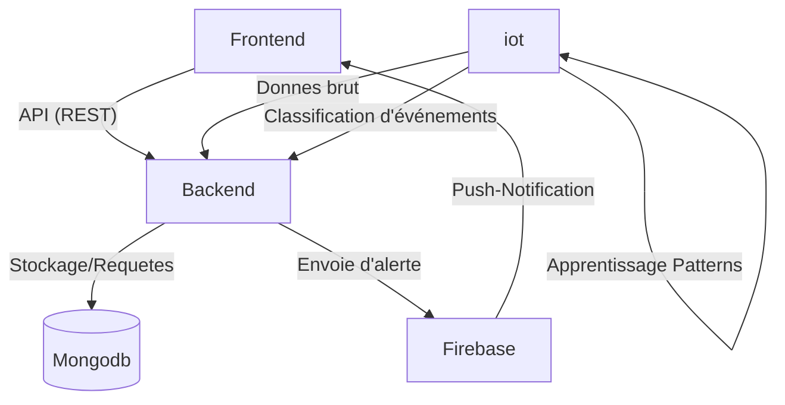
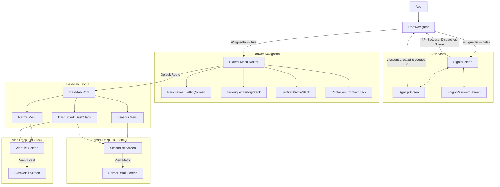
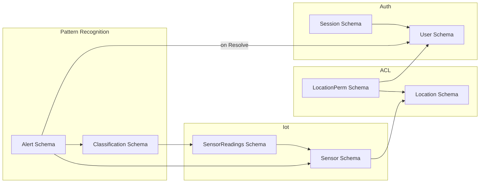

# Projet-integrateur-s


**Description** :
Projet intégrateur pour la classe de AEC Internet des objets et intelligence artificielle.\
Travail de trouver un concept a execution sur une période de temps de 4 semaines avec 3 membres.

### Table de Matières

- [Concept](#Concept)
- [Structure](#Structure)
- [Pour démarrer](#Pour-démarrer)
  - [Frontend](#Frontend)
  - [Backend](#Backend)
- [Addresses API](#Addresses-API)
- [Flow Navigation](#Flow-Navigation)
- [Structure Base de Donnees](#Structure-Base-de-Données)


## Concept
Ce projet est un système intégré de sécurité avec des composantes serveur backend, ainsi applicative sur téléphone intelligent et d’internet des objets intelligents. 

L'application mobile sert à aider la sécurisation d’édifices avec une interface simple à utiliser qui permet à l’utilisateur de voir les caméras, 
de voir qui rentre et sort de l’édifice, 
de savoir s'il y a un intrus à proximité ou dans l’édifice et de savoir s'il y a un dégât d'eaux ou de feu avec l’aide de l’intelligence artificielle entre autres. 
Nous voulons permettre à l’utilisateur de recevoir des notifications de l’état au besoin.

La plateforme de supervision permettra une gestion technique du bâtiment (GTC) qui regroupe les données des capteurs et commande les actions des appareils en temps réel et qui affiche toutes ces informations sur un seul écran.

## Structure

## Architecture

### Schéma global

HEAD
  |—  backend // modules backend et capteurs
    |-  src // backend server
      |-  scripts // les scripts pour le rpi
  |— frontend
    |—  app-web // pas fait (placeholder)
    |—  app-mobile // application react native
```

## Pour démarrer

### Backend
```aiignore
cd backend
npm install
```

Pour générer un fichier .env à partir du .env.example
```aiignore
# sur linux ou macos
cp .env.example .env
# sur windows
copy .env.example .env

# apres il faut remplir le fichier .env avec les vrais variables d'environnement
```

startup

```aiignore
node server.js
```

### Frontend

Dans un autre terminal
```aiignore
# si un .venv est active automatiquement par un ide
deactivate

# aller au folder
cd frontend/
# Installer pnpm globally si vous n'en avez pas
npm install --legacy-peer-deps
cd android
./gradlew clean
cd ..

```

Pour générer un fichier .env à partir du .env.example
```aiignore
# sur linux ou macos
cp .env.example .env
# sur windows
copy .env.example .env

# apres il faut remplir le fichier .env avec les vrais variables d'environnement
```

Un telephone doit être connecté au même réseau que le serveur et branche sur l'ordinateur en mode dev, et debug.

```aiignore
npx expo prebuild --platform android --clean               
npx expo run:android
```


build
```aiignore
npx expo prebuild --platform android --clean
npx expo run:android
```

## Addresses API


Routes Alertes:

- GET "/": envoie une list des Alertes
- GET "/:id": envoie l'alerte spécifie
- POST "/start": Ajoute une nouvelle alerte
- POST "/:id/resolve": Resout l'alerte spécifie
- POST "/:id/status": Retourne le status de l'alerte spécifie

Routes Authentification:
- POST "/register": Registre un nouvel utilisateur
- POST "/login": Login un utilisateur existant
- GET "/me": retourne les informations de l'utilisateur connecté

Routes Metric:
- GET "/hourly": Envoie des métriques horaires pour les alertes de l'utilisateur

Routes Sensors:
- POST "/new": Ajoute un nouveau capteur
- POST "/:id/arm": Met un capteur en mode actif
- POST "/:id/disarm": Met un capteur en mode inactif
- GET "/:id/status": Retourne le status du capteur spécifie
- POST "/:id/readings": Ajoute une nouvelle lecture pour le capteur spécifie
- GET "/:id/history":  retourne les lectures du capteur spécifie


## Flow Navigation




## Structure Base de Données


