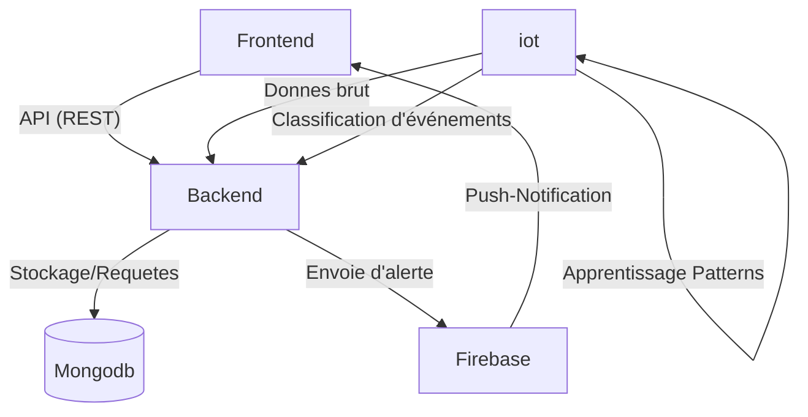
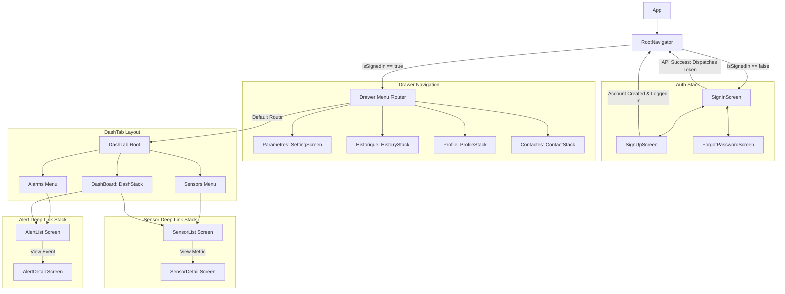
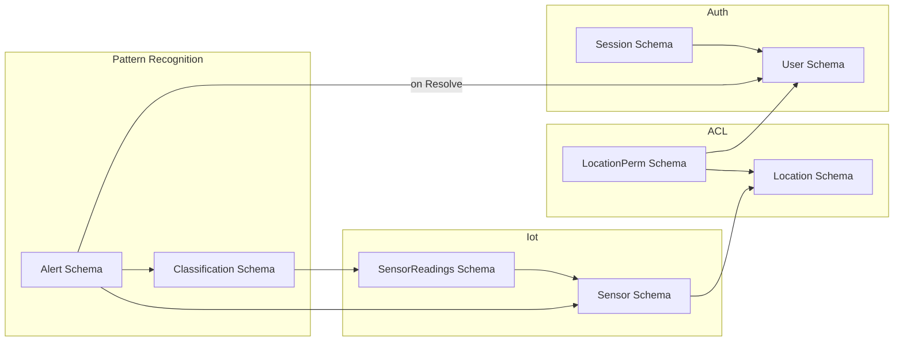

# Projet-integrateur-s


**Description** :
Pour notre cours de projet intégrateur dans notre AEC en Internet des objets et intelligence artificielle.\
On nous a demandé de trouver un concept et le mettre à exécution sur une période de 4 semaines en équipe. Notre équipe est composée de Barbara (fullstack), Blondel Junior (backend)et Gabriel (frontend).


### Table des matières

- [Concept](#Concept)
- [Pour démarrer](#Pour-démarrer)
  - [Frontend](#Frontend)
  - [Backend](#Backend)
- [Architecture](#Architecture)
- [Addresses API](#Addresses-API)
- [Flow Navigation](#Flow-Navigation)
- [Structure Base de Donnees](#Structure-Base-de-Données)


## Concept
Ce projet est un système intégré de sécurité avec des composantes serveur backend, ainsi applicative sur téléphone intelligent et d’internet des objets intelligents. 

L'application mobile sert à aider la sécurisation d’édifices avec une interface simple à utiliser qui permet à l’utilisateur de voir les caméras, 
de voir qui rentre et sort de l’édifice, 
de savoir s'il y a un intrus à proximité ou dans l’édifice et de savoir s'il y a un dégât d'eaux ou de feu avec l’aide de l’intelligence artificielle entre autres. 
Nous voulons permettre à l’utilisateur de recevoir des notifications de l’état au besoin.

La plateforme de supervision permettra une gestion technique du bâtiment (GTC) qui regroupe les données des capteurs et commande les actions des appareils en temps réel et qui affiche toutes ces informations sur un seul écran.

Il y aussi un aspect iot avec des composants comme le détecteur PIR, l'écran LCD I2C, LED (rouge et vert), buzzer active, un clavier 4x4, un Raspberry Pi et l'extension GPIO. On a fait le montage physique d'un système d'alarme.

Pour l'intelligence artifielle, on a décidé d'aller avec le pattern learning pour apprendre les habitudes de l'utilsateur et de savoir quand un mouvement est dans une heure calme ou une heure active.  L’objet intelligent collecte 7 jours de données sur les mouvements par heure, il calcule la fréquence en pourcentage de mouvement par heure. Il classe  les heures comme par exemple heure active ou heure calme et il détecte quand un mouvement est inattendu car il sort de l’heure active ou calme.

## Pour démarrer

### Backend
```aiignore
cd backend
npm install
```

Pour générer un fichier .env à partir du .env.example
```aiignore
# sur linux ou macos
cp .env.example .env
# sur windows
copy .env.example .env

# apres il faut remplir le fichier .env avec les vrais variables d'environnement
```

startup

```aiignore
node server.js
```

### Frontend

Dans un autre terminal
```aiignore
# si un .venv est active automatiquement par un ide
deactivate

# aller au folder
cd frontend/
# Installer pnpm globally si vous n'en avez pas
npm install --legacy-peer-deps
cd android
./gradlew clean
cd ..

```

Pour générer un fichier .env à partir du .env.example
```aiignore
# sur linux ou macos
cp .env.example .env
# sur windows
copy .env.example .env

# apres il faut remplir le fichier .env avec les vrais variables d'environnement
```

Un telephone doit être connecté au même réseau que le serveur et branche sur l'ordinateur en mode dev, et debug.

```aiignore
npx expo prebuild --platform android --clean               
npx expo run:android
```

build
```aiignore
npx expo prebuild --platform android --clean
npx expo run:android
```

### IOT et intelligence artificielle
```aiignore
cd backend/src/scripts
```

Pour activer le fichier .env et installer les dépendences
```aiignore
# sur linux ou macos
source venv/bin/activate
pip install -r requirements.txt
# sur windows
venv\Scripts\activate
pip install -r requirements.txt

# apres il faut changer le fichier .env avec les vrais variables d'environnement
```

startup

```aiignore
python3 main.py
```
## Branchement IOT
 Composant | GPIO / Broche | Fonction |
| :--- | :--- | :--- |
| **Détecteur PIR** | GPIO 4 | Détection de mouvement |
| **LED Rouge** | GPIO 5 | Indique que l'alarme est déclenchée |
| **LED Verte** | GPIO 22 | Indique que le système est armé |
| **Buzzer Actif** | GPIO 27 | Sonne quand l'alarme est déclenchée |
| **Écran LCD I2C** | SDA1 / SCL1 | Affiche les messages importants |
| **Clavier 4x4** | GPIO 6 à GPIO 26 | Permet d'entrer le code PIN |
| **Alimentation** | 3.3 V | Alimentation des composants compatibles |
| **Ground** | Ground (GND) | Retour électrique commun |

## Architecture

```
HEAD
  |—  backend // modules backend et capteurs
    |-  src // backend server
      |-  scripts // les scripts pour le rpi
  |— frontend
    |—  app-web // pas fait (placeholder)
    |—  app-mobile // application react native
```

### Schéma global



## Addresses API

Routes Alertes:

- GET "/": envoie une list des Alertes
- GET "/:id": envoie l'alerte spécifie
- POST "/start": Ajoute une nouvelle alerte
- POST "/:id/resolve": Resout l'alerte spécifie
- POST "/:id/status": Retourne le status de l'alerte spécifie

Routes Authentification:
- POST "/register": Registre un nouvel utilisateur
- POST "/login": Login un utilisateur existant
- GET "/me": retourne les informations de l'utilisateur connecté

Routes Metric:
- GET "/hourly": Envoie des métriques horaires pour les alertes de l'utilisateur

Routes Sensors:
- POST "/new": Ajoute un nouveau capteur
- POST "/:id/arm": Met un capteur en mode actif
- POST "/:id/disarm": Met un capteur en mode inactif
- GET "/:id/status": Retourne le status du capteur spécifie
- POST "/:id/readings": Ajoute une nouvelle lecture pour le capteur spécifie
- GET "/:id/history":  retourne les lectures du capteur spécifie


## Flow Navigation




## Structure Base de Données


