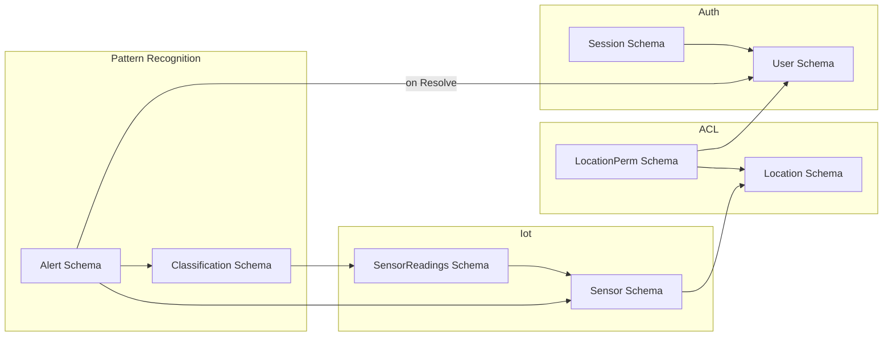

# Backend

### Table of Contents

- [Installation](#Pour-démarrer)
- [Addresses API](#Addresses-API)
- [Structure du projet](#Structure-du-projet)
- [Structure Base de Donnees](#Structure-Base-de-Données)
- [Dependencies](#dependencies)
- [Environment Variables](#environment-variables)

## Pour démarrer
```aiignore
npm install

```

## Startup

```aiignore
node server.js

```

## Addresses API


Routes Alertes:

- GET "/": envoie une list des Alertes
- GET "/:id": envoie l'alerte spécifie
- POST "/start": Ajoute une nouvelle alerte
- POST "/:id/resolve": Resout l'alerte spécifie
- POST "/:id/status": Retourne le status de l'alerte spécifie

Routes Authentification:
- POST "/register": Registre un nouvel utilisateur
- POST "/login": Login un utilisateur existant
- GET "/me": retourne les informations de l'utilisateur connecté

Routes Metric:
- GET "/hourly": Envoie des métriques horaires pour les alertes de l'utilisateur

Routes Sensors:
- POST "/new": Ajoute un nouveau capteur
- POST "/:id/arm": Met un capteur en mode actif
- POST "/:id/disarm": Met un capteur en mode inactif
- GET "/:id/status": Retourne le status du capteur spécifie
- POST "/:id/readings": Ajoute une nouvelle lecture pour le capteur spécifie
- GET "/:id/history":  retourne les lectures du capteur spécifie

## Structure du projet


## Structure Base de Données



## Dependencies

## Environment Variables

