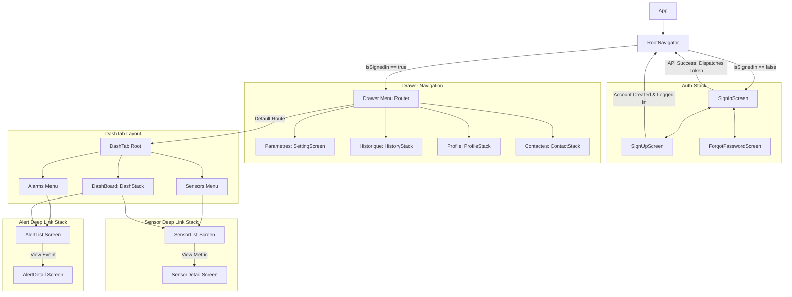

# Frontend

### Table of Contents

- [Installation](#Pour-démarrer)
- [Addresses API](#Addresses-API)
- [Structure du projet](#Structure-du-projet)
- [Dependencies](#dependencies)
- [Environment Variables](#environment-variables)


## Pour démarrer
pour installer les dependances frontend globales
```aiignore
cd frontend/

# Installer pnpm globally si vous n'en avez pas
npm install -g pnpm

# Installer pnpm pour le monorepo
pnpm install
pnpm install --no-frozen-lockfile --no-strict-peer-dependencies

```


pour demarrer le serveur de dev
```aiignore
pnpm dev
```

pour demarrer seulement le ui web
```aiignore
pnpm --filter app-web dev
```
ou pour le mobile
```aiignore
pnpm --filter app-mobile dev

```

Pour les tests
```aiignore
npx jest --no-cache

```

## Addresses API

les requêtes sont envoyées au serveur à l'adresse de base http://{address_ip_serveur}:3000/api
type capteur: http://{address_ip_serveur}:3000/api/sensors
type capteur: http://{address_ip_serveur}:3000/api/alerts
type auth: http://{address_ip_serveur}:3000/api/auth

Certaines requêtes requirent un token d'authentification, ou un nip dans le corps de la requete.

## Structure du projet





## Dependencies
Liste:

- **React**: Version 19.0.0
- **React DOM**: Version 19.0.0
- **Axios**: Version 1.20.0
- **Jest**: Version 29.2.1
- **Babel**: Version 7.20.0
- **Dotenv**: Version 17.4.2
- **Mongoose**: Version 9.9.4
- **Express**: Version 5.2.1
- **Date-Fns**: Version 4.4.0
- **React Navigation**: Version 7.10.22
- **React Native**: Version 0.86.3
- **React Native Vector Icons**: Versions 13.1.3 and 21.1.3
- **Expo**: Version 57.0.19
- **Victory Native**: Version 42.0.1
- **YAML**: Version 2.9.0
- **React Native Worklets**: Version 0.10.1
- **React Native Gesture Handler**: Version 2.32.0
- **React Native Safe Area Context**: Version 5.7.0
- **Lucide React**: Version 1.40.0
- **React Native Masked View**: Version 0.3.2
- **React Native DateTime Picker**: Version 9.2.0
- **React Native Test Renderer**: Version 19.2.3
- **Expo Device**: Version 57.0.1
- **Expo Secure Store**: Version 57.0.3
- **Expo Constants**: Version 57.0.17
- **Json Web Token**: Version 9.0.3


## Environment Variables

Verifier que vos variables env sont correctement définies. 
Vous pouvez créer un fichier `.env` dans le répertoire racine avec le contenu suivant:

EXPO_PUBLIC_SERVER_IP=address_ip_serveur
EXPO_PUBLIC_SERVER_PORT=3000

Assurez-vous de remplacer les champs avec les adresses serveur réelle.


